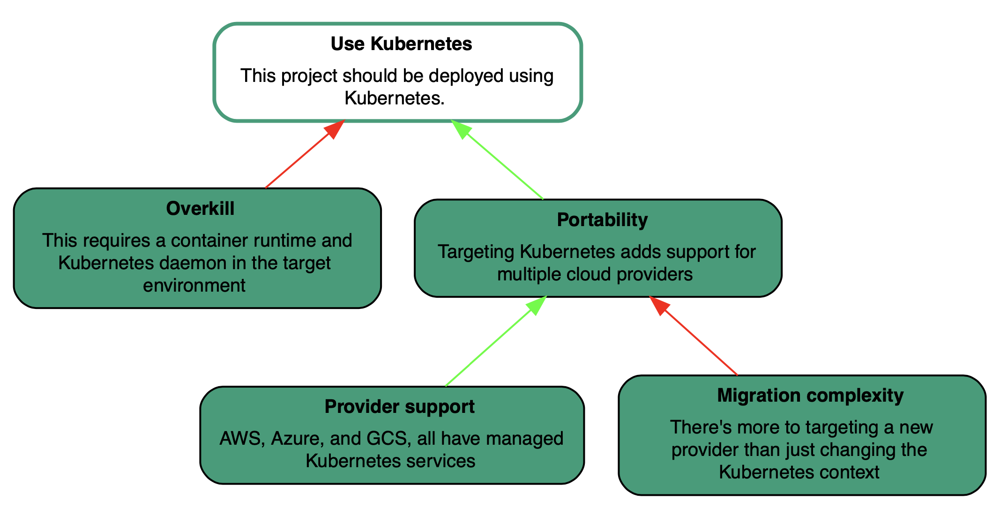
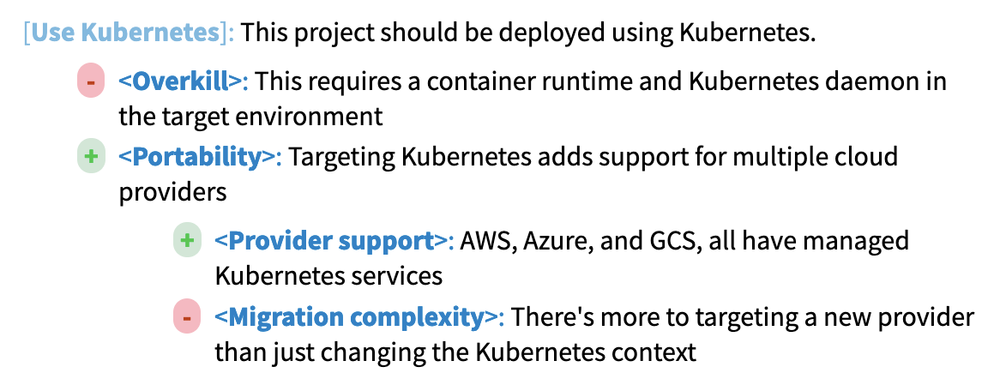
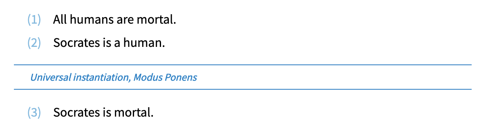
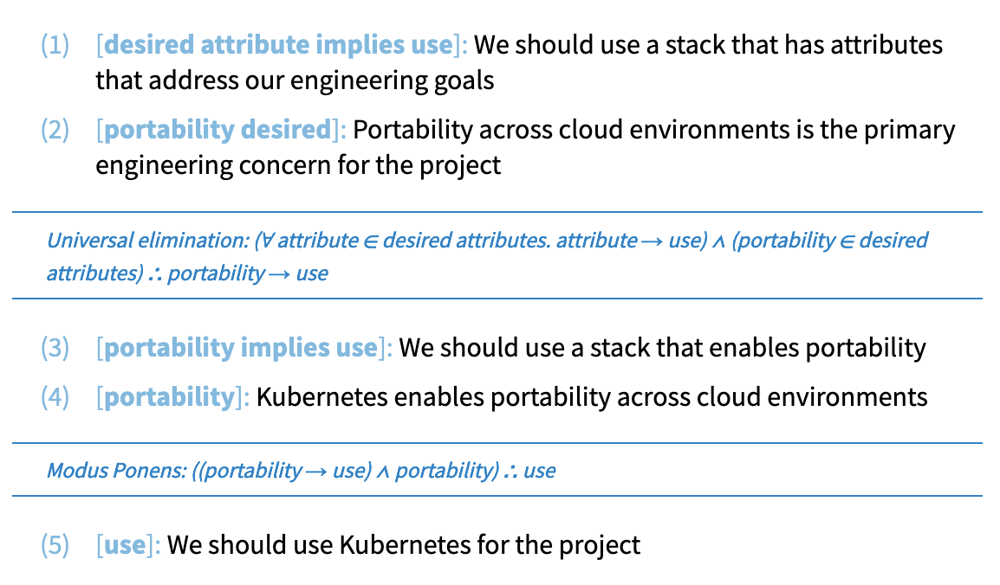

# Argdown

[Argdown](https://argdown.org/) is a Markdown-like text format for structuring
and manipulating (e.g. visualizing) arguments.

The two fundamental building blocks of an Argdown document are _statements_ and _arguments_.
Every regular, unadorned Markdown paragraph is a _statement_. On the difference
between statements and arguments:

> Somebody who makes a statement claims that something is true. If you do not
> know anything about it, this claim alone will not help you much in deciding
> if you should accept it or not. Somebody who makes an argument for a claim
> tries to show (by logical inference) that if you already accept some other
> statements (the premises) you should also accept (and believe) the statement
> in question (the conclusion).
>
> [Argdown syntax guide](https://argdown.org/syntax/#arguments)

You can sketch out an argument for a statement with pros (`+`) and cons (`-`):

```argdown
[Use Kubernetes]: This project should be deployed using Kubernetes.
  - <Overkill>: This requires a container runtime and Kubernetes daemon
    in the target environment
  + <Portability>: Targeting Kubernetes adds support for multiple cloud
    providers
    + <Provider support>: AWS, Azure, and GCS, all have managed
      Kubernetes services
    - <Migration complexity>: There's more to targeting a new provider
      than just changing the Kubernetes context
```

Map representation:



HTML rendering:



## Premise-Conclusion-Structures (PCS)

All arguments have premises and conclusions, and can be "reconstructed" into
premise-conclusion-structure, which Argdown has syntax for:

```argdown
(1) All humans are mortal.
(2) Socrates is a human.
--
Universal instantiation, Modus Ponens
{uses: [1,2], logic: ["deductive", "predicate logic"]}
--
(3) Socrates is mortal.
```



> This internal structure is called a premise-conclusion-structure (pcs). The
> act of working out an argument's pcs is called reconstruction because we
> often have to add or reformulate parts of the argument that were left
> implicit. An argument to which we have assigned a pcs is "reconstructed." If
> a pcs has not been assigned yet, the argument is still "unreconstructed."
>
> Argdown also supports reconstructing more complex arguments: A complex
> argument consists of a sequence of "inferential steps" from premises to
> conclusions in which each conclusion is used together with new premises to
> derive the next conclusion. The last conclusion of such a complex argument is
> called the main conclusion, the others are called intermediary conclusions.
> In contrast, a simple argument only contains one inferential step.

PCS for that Kubernetes argument:

```argdown
===
model:
  shortcodes:
    ":therefore:": {unicode: "∴"}
    ":in:": {unicode: "∈"}
===

(1) [desired attribute implies use]: We should use a stack that has
    attributes that address our engineering goals
(2) [portability desired]: Portability across cloud environments is the
    primary engineering concern for the project
--
Universal elimination: (:A: attribute :in: desired attributes. attribute .->. use) .^. (portability :in: desired attributes) :therefore: portability .->. use
--
(3) [portability implies use]: We should use a stack that enables
    portability 
(4) [portability]: Kubernetes enables portability across cloud
    environments
--
Modus Ponens: ((portability .->. use) .^. portability) :therefore: use
--
(5) [use]: We should use Kubernetes for the project
```

Which renders as:



## See also

- [_List of Inference Rules_ (Wikipedia)](https://en.wikipedia.org/wiki/List_of_rules_of_inference)
