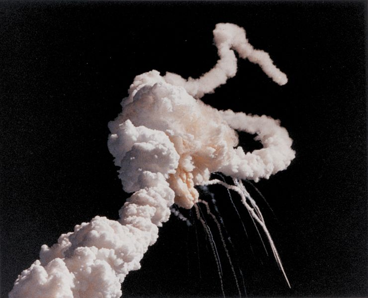

> Is programming a super-power? Why or why not? What are the implications if it is?

I recently read a pretty compelling argument for why programming is not a super power.

<!-- MORE -->

> Given:
>
> P → Q : If programming is a super power, then humans cannot program.
>
> Superpower is a popular culture term for a fictional superhuman ability. (wikipedia — superpower)
> Superhuman qualities are qualities that exceed those found in humans. (wikipedia — Superhuman)
>
> -Q: humans can program
>
> Argument:
>
> P → Q (If programming is a super power, then humans cannot program.)
>
> -Q (humans can program)
>
> — — — — — — — — — — — — — — — — —
>
> -P (Programming is not a super power)
>
> -- Anna McMahon, Programming is not a superpower

<!-- more -->

It seems that by definition, since humans *can* program, programming can't be a superhuman ability. Ok. Sounds alright. But let's give her sources another glance:

> Superhuman abilities may result from **human enhancement**.
> *...*
> Human enhancement is any attempt to temporarily or permanently overcome the current limitations of the human body through natural or artificial means.
> -- Wikipedia, Superhuman

So, the same source that reports that superpowers are, by definition, above human ability, also outlines a methodology by which humans can acquire such powers.

I contend that programming, or perhaps digital computing in general, is a form of human enhancement. Armed with a terminal and an editor, a computer scientist can compute untold wonders: she can parse vast oceans of data to track down, and bring justice to criminals (starting to sound like a bona fide superhero), or he can command legions of machines to attack his enemies (supervillain?).

All that said, as our heroes have taught us, with great power, there must come great responsibility. As Ben Adida puts it:

> We, software engineers, have superpowers most people don’t remotely understand. The trust society places in us is growing so rapidly that the only thing that looks even remotely similar is the trust placed in doctors.
> -- Ben Adida, The Responsibility We Have as Software Engineers

As computer science comes of age as a profession, or perhaps more specifically, as computer sciences become increasingly intertwined with critical infrastructure (on which many lives may depend), we must accept, nay welcome this increased trust *and* the higher expectations it ships with.

This still leaves one key argument from Anna's thesis unaddressed:

> Super powers are widely understood as how wikipedia described them, qualities that exceed those found in humans. Why would we want to promote programming as an unattainable thing?
>
> It is important that everyone knows that programming is not for the super-human, super-smart, super-whatever, **it is for everybody**.
> Anna McMahon, Programming is not a superpower

I think this is a valid concern. To answer, we look to the mythos of superheroes (and here I will be addressing "American comic book superheroes" just so we have a standard to go by).

The stories of superheroes are not told as a means to tease listeners about talents that they will never acquire. I think the purpose of superhero stories is to spark the fantasies and imaginations of listeners and inspire them to aspire to the strength, cunning, and good-heartedness of their heroes. When we're kids (and I speak from personal experience here), we don't see Superman and think, "Wow, he's so cool, but it's so sad that I'll never be him that I'm just going to go sulk in a corner," we see Superman, don our red capes (which in my case was lovingly sewn by my mother), and set out to save the world (even if that world exists purely in our imaginations).

By the same token, saying that programming is a superpower both acknowledges the challenges associated with achieving mastery **and** hints at the awesome power wielded by computer scientists.

So let us don our proverbial capes, masks, helms, and supersuits and do some good.

#### Sources

- Anna McMahon, [*Programming is not a superpower*](https://medium.com/@annamcmahon/programming-is-not-a-superpower-607e017666e#.wcmb5az3p)
- Wikipedia, [*Superhuman*](https://en.wikipedia.org/wiki/Superhuman)
- Ben Adida, [*The Responsibility We Have as Software Engineers*](https://benlog.com/2015/05/23/the-responsibility-we-have-as-software-engineers)
- Image: Alberta Rose, [*Challenger Disaster*](http://disasters.albertarose.org/challenger_disaster.html)
