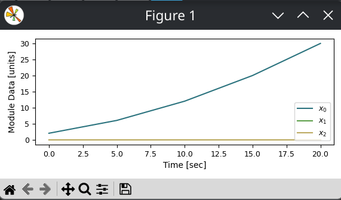
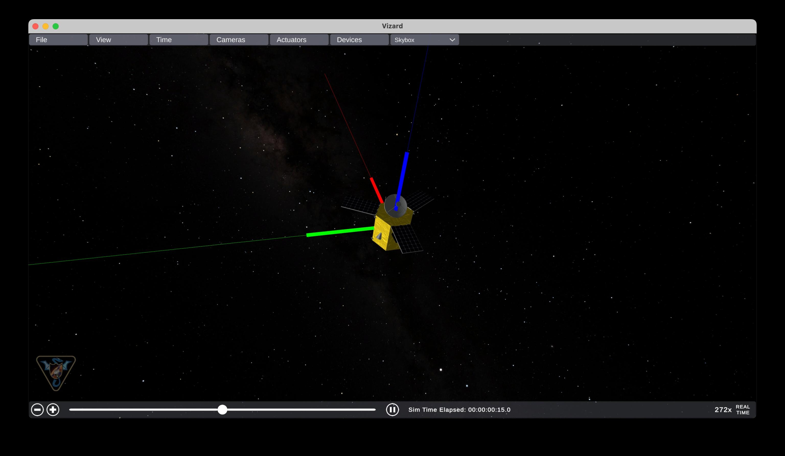

I recently found myself responsible for figuring out how to evaluate [satellite attitude
control algorithms][control alg], purely in software.

[control alg]: https://en.wikipedia.org/wiki/Spacecraft_attitude_determination_and_control#Control_algorithms

Now, I can geek out with the best of them on space and astrophysics, but I haven't taken
it much deeper than "casual interest" since middle school. Meaning: **I had no clue
where to start**. No clue about the tools of the trade, the terms of art, or even what
the inputs and outputs of such a system would be.

Luckily, my brief time on this Earth coincides with that of Wikipedia.

[The article on "Spacecraft attitude determination and control"][control] is decently
readable from a lay perspective, introduces the key concepts and goals in attitude
control, and gives examples of the hardware (sensors and actuators) and software that
comprise attitude control systems. Here's my read:

[control]: https://en.wikipedia.org/wiki/Spacecraft_attitude_determination_and_control

A satellite's attitude control system is there to keep the craft pointing in the right
direction. It involves sensors to measure the current orientation, actuators to change
the orientation, and control algorithms to compute the actuator commands that bring the
actual orientation towards the target orientation.

This description hints at the contours of an API for our evaluation system:

- a control algorithm is a function from sensor inputs to actuator commands
- the quality of a control algorithm relates to the delta, over time, between measured
  and target orientation (there may be competing objectives here, such as energy used
  vs. time spent off-axis)

## Implementation

With a sketch of the interface in mind, I wanted to implement a basic example&mdash;a
simple control algorithm and a scoring function&mdash;to start identifying gaps in the
API. Sitting down to code, I immediately found my first gap: I needed a physics
subsystem to simulate the actual motion resulting from a control algorithm's outputted
actuator commands, to in turn evaluate the delta between real and target orientation.

My options, as I saw them, were to hand-roll a simple attitude dynamics system myself,
or to search for an existing framework. I hesitated at first to take the latter path;
instead of learning universal physics, I'd just be learning the ins and outs--the very
human design choices--of the framework, and all the unused features would introduce
accidental complexity and tech debt into an otherwise green system.

I changed my mind when I stumbled on [Basilisk].


[Basilisk]: https://avslab.github.io/basilisk/

> Basilisk [...] is a software framework capable of both faster-than realtime spacecraft
> simulations [...] as well as providing real-time options for hardware-in-the-loop
> simulations.
>
> The [...] framework is targeted for [...] astrodynamics research modeling the orbit and
> attitue of complex spacecraft systems.
>
> &mdash; [avslab.github.io](https://avslab.github.io/basilisk/)

The two factors that really sold me were:

1. Pre-built modules for all the necessary physics, sensors, and actuators
2. A companion tool, [Vizard], that creates interactive 3D renders of Basilisk
   simulations. This in particular--an interactive, visual tool--I felt would really
   help me learn the domain. More on this later (but in the meantime, check out this
   [example video][Vizard vid]).

[Vizard]: https://avslab.github.io/basilisk/Vizard/Vizard.html
[Vizard vid]: https://hanspeterschaub.info/Movies/Vizard-Basic-Features.mp4

Of course, choosing a large, mature, existing framework comes with its own (steep)
learning curve, the first hurdle of which was **getting the darn thing to run.**

## Compiling Basilisk: ARM edition

There's no pre-built Basilisk wheel on PyPI, nor on their [GitHub releases]. However,
work has been done [in the last year(-ish)][pypi instructions] to adopt modern Python
packaging techniques, allowing, for example, the following to work:

```bash
pixi add bsk --git https://github.com/AVSLab/basilisk.git --pypi --branch develop
```

(Adjust to your Python project tool[^1]. More detail [here][wheel].)

[^1]: A note for other Pixi users: I had to set
      ```toml
      [tool.hatch.metadata]
      allow-direct-references = true
      ```
      in my `pyproject.toml` for this `pixi add` command to work.

[GitHub releases]: https://github.com/AVSLab/basilisk/releases
[installation instructions]: https://avslab.github.io/basilisk/Install/installOnLinux.html
[pypi instructions]: https://github.com/AVSLab/basilisk/commit/7d90c3b05492981adcacd74a7e95df2ee350dedb
[wheel]: https://avslab.github.io/basilisk/Install/pipInstall.html

This command will clone the source code, invoke the [Conan]/ [CMake] -based build system
via `setuptools` to build the underlying C/C++ extensions for your machine's
architecture, and install the package to the active environment.

[Conan]: https://conan.io/
[CMake]: https://cmake.org/

## A basic simulation

The basic operational metaphors of Basilisk are:

- **Modules** pass messages to each other
- **Tasks** execute Modules sharing an update rate
- **Processes** group Tasks into logical units (e.g. "this satellite" and "that
  satellite")

With all that in mind, what does "Hello, world!" look like in Basilisk? Here's my take,
distilled from the first few pages of the ["Fundamentals of Basilisk"][fundamentals]
docs:

[fundamentals]: https://avslab.github.io/basilisk/Learn/bskPrinciples/bskPrinciples-1.html

```python
from Basilisk.moduleTemplates import cModuleTemplate
from Basilisk.utilities import SimulationBaseClass, macros as bskutil

# (1)
sim = SimulationBaseClass.SimBaseClass()
procDynamics = sim.CreateNewProcess("procDynamics")
procDynamics.addTask(sim.CreateNewTask("taskDynamics", bskutil.sec2nano(5.)))

# (2)
mod = cModuleTemplate.cModuleTemplate()
mod.ModelTag = "cModule1"
sim.AddModelToTask("taskDynamics", mod)

# (3)
sim.InitializeSimulation()
sim.ConfigureStopTime(bskutil.sec2nano(20.))
sim.ExecuteSimulation()
```

1. Create the simulation container with a process and a task (nested in that order)
2. Create a module and assign it to a task for execution
3. Initialize and execute the simulation

Running the above produces the following console output:

```text
BSK_INFORMATION: Variable dummy set to 0.000000 in reset.
BSK_INFORMATION: C Module ID 1 ran Update at 0.000000s
BSK_INFORMATION: C Module ID 1 ran Update at 5.000000s
BSK_INFORMATION: C Module ID 1 ran Update at 10.000000s
BSK_INFORMATION: C Module ID 1 ran Update at 15.000000s
BSK_INFORMATION: C Module ID 1 ran Update at 20.000000s
```

showing the connection between the task's update frequency and the simulation's stop
time (note that this doesn't take 20 seconds to run: Basilisk seems to be smart about
timekeeping, allowing it to go "faster-than-realtime").

## A step towards usefulness: messages

The messages our modules emit and consume are our main means to observe the system under
test.

```python
sim = SimulationBaseClass.SimBaseClass()
procDynamics = sim.CreateNewProcess("procDynamics")
procDynamics.addTask(sim.CreateNewTask("taskDynamics", bskutil.sec2nano(5.)))

mod1 = cModuleTemplate.cModuleTemplate()
mod1.ModelTag = "cModule1"
sim.AddModelToTask("taskDynamics", mod1)

# NEW: add a second module
mod2 = cModuleTemplate.cModuleTemplate()
mod2.ModelTag = "cModule2"
sim.AddModelToTask("taskDynamics", mod2)

# NEW: mutual connection between mod1 and mod2
mod2.dataInMsg.subscribeTo(mod1.dataOutMsg)
mod1.dataInMsg.subscribeTo(mod2.dataOutMsg)

# NEW: a recorder module for collecting mod2 output messages
modRec = mod2.dataOutMsg.recorder()
sim.AddModelToTask("taskDynamics", modRec)

sim.InitializeSimulation()
sim.ConfigureStopTime(bskutil.sec2nano(20.))
sim.ExecuteSimulation()
```

The attributes of `modRec` correspond to the attributes of the message type flowing over
the recorded channel. In the case of the recorded `cModuleTemplate` module, that's a
single `dataVector` array, with a row for each recorded message and a column for each of
an arbitrary set of dummy features. Together with `modRec.times()`, we have X/Y pairs to
plot message values over time:

```python
for feature in range(3):
    plt.plot(
        modRec.times() * bskutil.NANO2SEC,
        modRec.dataVector[:, feature],
    )
```



## Visualization

To bring it all together, let's add a satellite to our "Hello, world!" simulation and
see what it looks like in 3D:

```python
from Basilisk.simulation import spacecraft
from Basilisk.utilities import (
    SimulationBaseClass,
    macros as bskutil,
    vizSupport as bskviz,
)

sim = SimulationBaseClass.SimBaseClass()

procDynamics = sim.CreateNewProcess("procDynamics")
procDynamics.addTask(sim.CreateNewTask("taskDynamics", bskutil.sec2nano(5.)))

# NEW: a new module type: *Spacecraft*
modSpacecraft = spacecraft.Spacecraft()
modSpacecraft.ModelTag = "spacecraftBody"
sim.AddModelToTask("taskDynamics", modSpacecraft)

# NEW: emit visualization file for Vizard
viz = bskviz.enableUnityVisualization(
    sim,
    "taskDynamics",
    modSpacecraft,
    saveFile="hello-world.bin"
)

sim.InitializeSimulation()
sim.ConfigureStopTime(bskutil.sec2nano(20.0))
sim.ExecuteSimulation()
```



I think this leaves us at a good stopping point for now. The [Spacecraft module]
encapsulates the rigid body dynamics I'll need to simulate axial motion, and supports a
promising-sounding [`reactionWheelStateEffector` module] that sounds like just the thing
for comparing attitude control algorithms.

[Spacecraft module]: https://avslab.github.io/basilisk/Documentation/simulation/dynamics/spacecraft/spacecraft.html
[`reactionWheelStateEffector` module]: https://avslab.github.io/basilisk/Documentation/simulation/dynamics/reactionWheels/reactionWheelStateEffector.html#reactionwheelstateeffector
