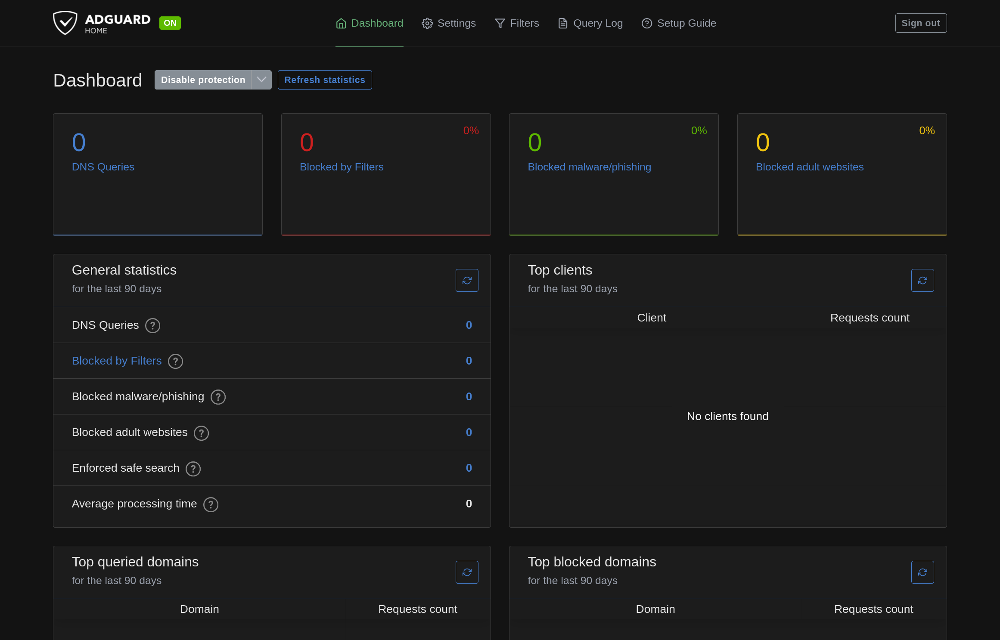
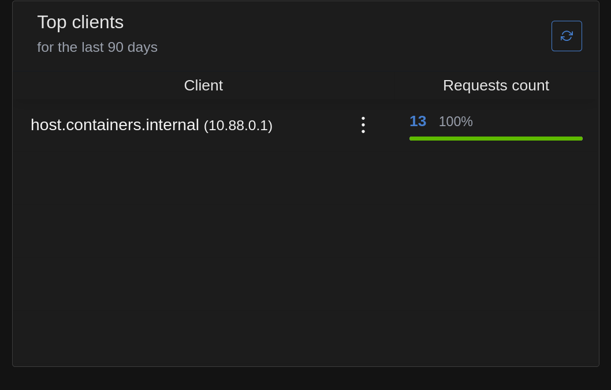
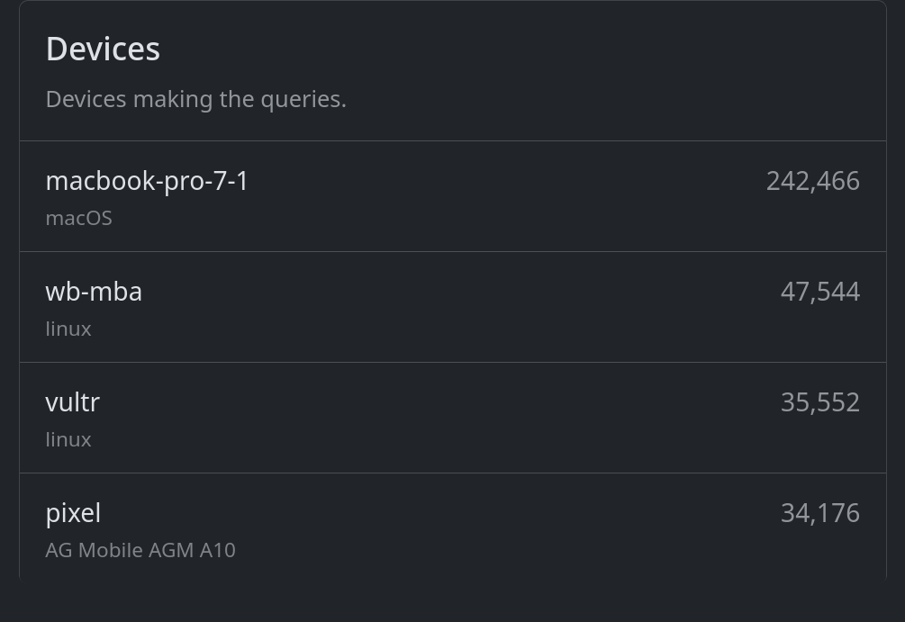

Of late, my living arrangements and travel schedule have made it difficult to keep my
own server hardware online at home. As a result, I've been on the prowl for
privacy-friendly, cloud-based alternatives to some of the services I normally self-host.

Not long ago, I switched from [Pi-hole] to [NextDNS] for my network-wide, DNS-based
tracking, malware, and yes, **ad** blocking needs, and have been very satisfied. They
have a [generous free tier][NextDNS pricing], and a [paragon among privacy
policies][NextDNS privacy]. The killer feature for me, though, has been the [Tailscale
integration], which was trivial to set up and provides blocking for my entire tailnet.

[Pi-hole]: https://pi-hole.net/
[NextDNS]: https://nextdns.io/
[NextDNS pricing]: https://nextdns.io/pricing
[NextDNS privacy]: https://nextdns.io/privacy
[Tailscale integration]: https://tailscale.com/kb/1218/nextdns

**However:**

The technique outlined in my [last post] has made self-hosting _much_ closer at-hand, in
spite of circumstances. Motivated by my perennial (if low-grade, in the case of NextDNS)
distrust of third-party services, and having seen the name pop up here and there last
time I had to troubleshoot my Pi-hole, I decided to take [AdGuard Home] for a spin.

[last post]: /posts/2025-12-30-rocky-quadlet/
[AdGuard Home]: https://adguard.com/en/adguard-home/overview.html

Here's the full Quadlet config, adapted from the **Quick Start** instructions for the
[Docker image]:

```systemd
# /etc/containers/systemd/adguard.container
[Container]
Image=docker.io/adguard/adguardhome:v0.107.71
PublishPort=53:53/tcp
PublishPort=53:53/udp
PublishPort=80:80/tcp
PublishPort=443:443/tcp
PublishPort=443:443/udp
PublishPort=3000:3000/tcp
PublishPort=853:853/tcp
PublishPort=853:853/udp
Volume=adguard:/opt/adguardhome/work
Volume=/opt/adguard/conf:/opt/adguardhome/conf:z

[Unit]
After=adguard.volume
Requires=adguard.volume
```

```systemd
# /etc/containers/systemd/adguard.volume
[Volume]
VolumeName=adguard
```

[Docker image]: https://hub.docker.com/r/adguard/adguardhome

I configured a [Tailscale service] pointing to the admin dashboard, walked through the
setup wizard, and was presented with my very own AdGuard Home server:

[Tailscale service]: https://tailscale.com/kb/1552/tailscale-services



The whole process of translating the Docker instructions into Quadlet config and
troubleshooting a couple startup issues and Tailscale config took maybe 5 minutes; not
bad at all. I was able to use `tailscale cert` to populate the [**Encryption**
config][encryption], enabling DNS-over-HTTPS and DNS-over-QUIC (though I haven't been
able to get "Redirect to HTTPS automatically" working; enabling it triggers a redirect
loop, I'm guessing some unfortunate interaction with the Tailscale service wrapper).

[encryption]: https://github.com/AdguardTeam/AdguardHome/wiki/Encryption

All in all, it was a great onboarding experience, and I'm glad to have AdGuard as an
option.

**However:**

For the time being, I think I'm going to stick with NextDNS; the Tailscale integration
is too cool to ignore. In particular, look at how client stats are reported by AdGuard:



vs. NextDNS:



I like knowing the breakdown of DNS traffic volume by device. If there's a way to teach
AdGuard each client's IP (or other metadata) so that everything isn't rolled into the IP
address of the Podman NIC, I haven't found it yet.

Regardless of whether I can solve that nit, I'm grateful to be spoiled for choice of
weapons in the arms race against online surveillance!
